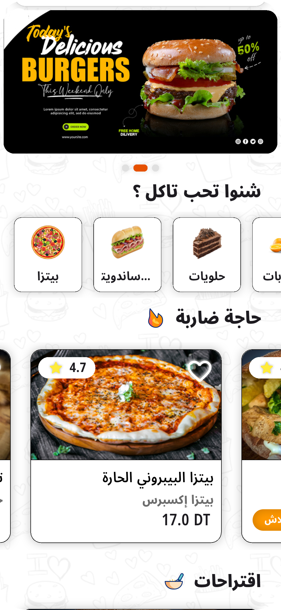
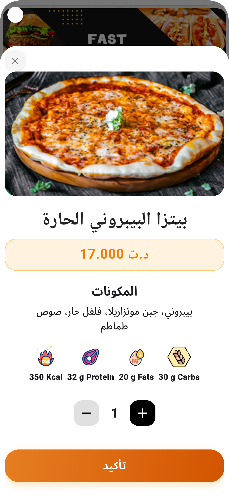
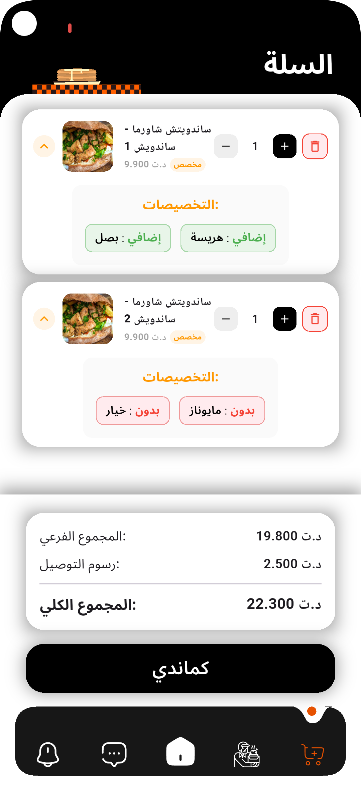
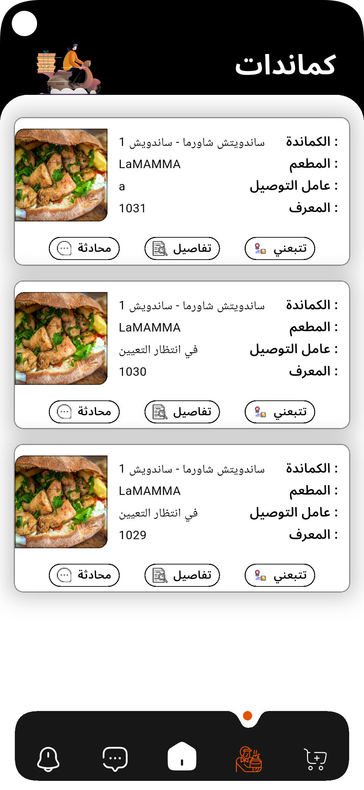
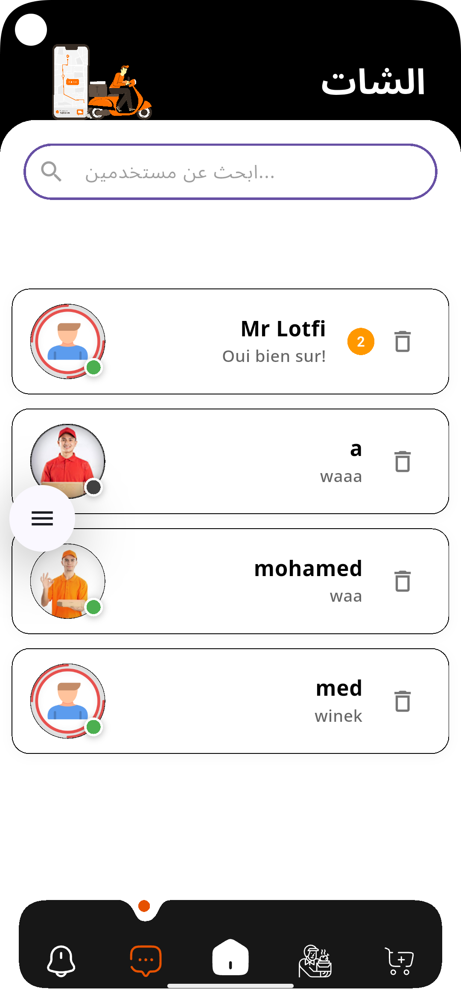

# 🚀 Deliverini TN

<div align="center">


**A modern food delivery app built with Flutter featuring real-time order tracking and seamless user experience**

[Demo Video](#-demo) • [Features](#-features) • [Screenshots](#-screenshots)

</div>

---

## 📱 About

**Deliverini TN** is a full-featured food delivery application designed for the Tunisian market. The app provides an intuitive platform for browsing restaurants, customizing orders, and tracking deliveries in real-time with Firebase backend integration.

## ✨ Features

- 🍔 **Browse Menu** - Explore various food categories (Pizza, Sandwiches, Desserts, etc.)
- 🛒 **Smart Cart** - Add items with customizations and manage quantities
- 💰 **Price Calculator** - Automatic subtotal and delivery fee calculation
- 📦 **Order Tracking** - Real-time order status updates with delivery progress
- 💬 **Chat Support** - Direct messaging with delivery personnel
- 🎨 **Arabic Support** - Full RTL interface for Arabic language
- 🔥 **Live Updates** - Firebase Firestore for real-time data synchronization

## 🎯 Tech Stack

- **Frontend**: Flutter & Dart
- **Backend**: Firebase (Authentication, Firestore Database)
- **State Management**: Provider/Bloc pattern
- **Real-time Updates**: Cloud Firestore listeners
- **UI/UX**: Custom animations and Material Design 3

## 📸 Screenshots

<div align="center">

| Home Screen | Product Details | Cart & Checkout |
|------------|-----------------|-----------------|
|  |  |  |

| Chat Feature | Order Tracking | Conversations |
|-------------|----------------|-----------------|
|  |  |  |


</div>

## 🎥 Demo

[Demo.mp4](https://github.com/ayoub-rahmani/Deliverini_TN/demo.mp4)

*Full app walkthrough showing ordering flow and real-time tracking (1 min)*

## 🚀 Key Highlights

- **Customization Options**: Users can add/remove ingredients and select extras
- **Order Management**: View order history with detailed status tracking
- **Restaurant Details**: Ratings, nutritional information, and pricing
- **Responsive Design**: Smooth animations and modern UI components
- **Delivery Tracking**: Live status updates from order placement to delivery

## 💡 What I Learned

- Implementing Firebase Firestore for real-time data management
- Building complex cart functionality with state management
- Creating smooth user flows for e-commerce applications
- Designing bilingual (Arabic/English) interfaces with RTL support
- Integrating real-time chat features for customer support

## 📝 Installation

```bash
# Clone the repository
git clone https://github.com/ayoub-rahmani/Deliverini_TN.git

# Navigate to project directory
cd Deliverini_TN

# Install dependencies
flutter pub get

# Run the app
flutter run
```

## 🔧 Configuration

Add your Firebase configuration files:
- `android/app/google-services.json`
- `ios/Runner/GoogleService-Info.plist`

## 👨‍💻 Developer

**Ayoub Rahmani**

- Portfolio: [ayoub-rahmani.github.io](https://ayoub-rahmani.github.io)
- LinkedIn: [ayoub-rahmani-linkêdin](https://www.linkedin.com/in/ayoub-rahmani-linkêdin)
- Email: ayoub.rahmani.dev@gmail.com

---

<div align="center">

⭐ If you found this project helpful, consider giving it a star!

</div>
